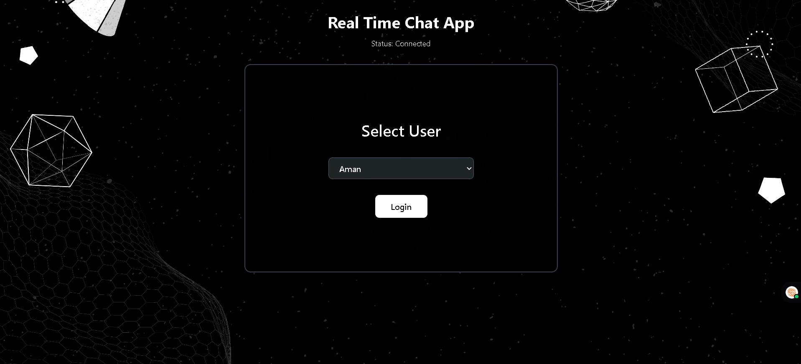
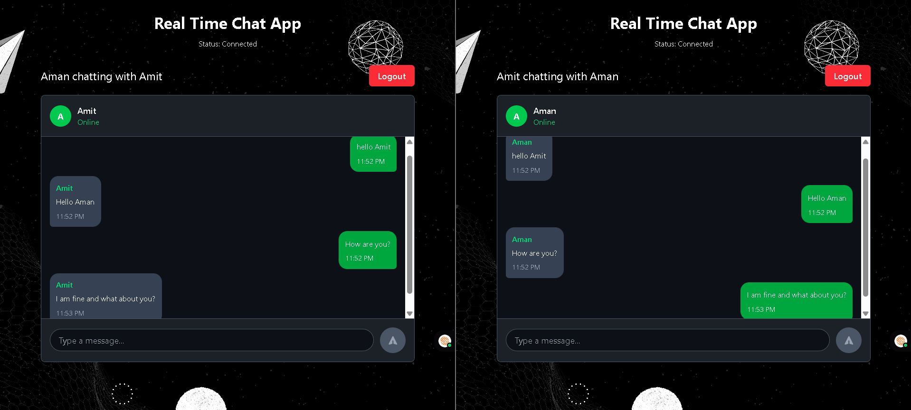

⚡ Real-Time Chat App  –  Powered by ZEGOCLOUD

A minimal yet powerful peer-to-peer chat application built with React + TailwindCSS, using ZEGOCLOUD ZIM SDK.
This app simulates 1-on-1 messaging between two users (Aman & Amit) with real-time updates, message history, and secure token-based login.

🔧 Tech Stack

⚛️ React (Vite)

🌐 ZEGOCLOUD ZIM SDK

🎨 TailwindCSS

📜 JavaScript (ES6)

🔐 dotenv (.env) for managing secrets (App ID, tokens)

✨ Features

✅ Real-time peer-to-peer messaging

✅ Token-based login using ZEGOCLOUD

✅ In-memory message history

✅ Online status indicator

✅ Two-user chat simulation (Aman & Amit)

✅ Smooth and responsive UI with TailwindCSS

✅ Auto-scroll to latest message

✅ Logout / re-login functionality

📸 Screenshots
Login Screen	Chat Interface

🚀 Live Demo
🌐 Click here to try it live :-> https://amanvermachatapp.netlify.app/

🛠️ Setup Instructions
1. Clone the repository

git clone https://github.com/amanverma420/Chatapp.git

cd chatappzego

2. Install dependencies

npm install

3. Configure environment variables

Create a .env file in the root directory and add:

VITE_ZIM_APP_ID=your_zego_app_id

VITE_TOKEN_AMAN=your_token_for_aman

VITE_TOKEN_AMIT=your_token_for_amit

4. Run the development server

npm run dev

Now open your browser and visit: http://localhost:5173

📚 Useful Resources

📘 [ZEGOCLOUD SDK Docs](https://www.zegocloud.com/docs)

📘 [React Docs](https://react.dev/)

📘 [TailwindCSS Docs](https://v2.tailwindcss.com/docs)

📝 License
This project is licensed under the MIT License.
Feel free to use, modify, and distribute — just give proper credit. 😊

✨ Author

👤 Aman Verma

📧 Email: amanv2225@gmail.com

🔗 LinkedIn: [LinkedIn URL](https://www.linkedin.com/in/amanverma420/)

