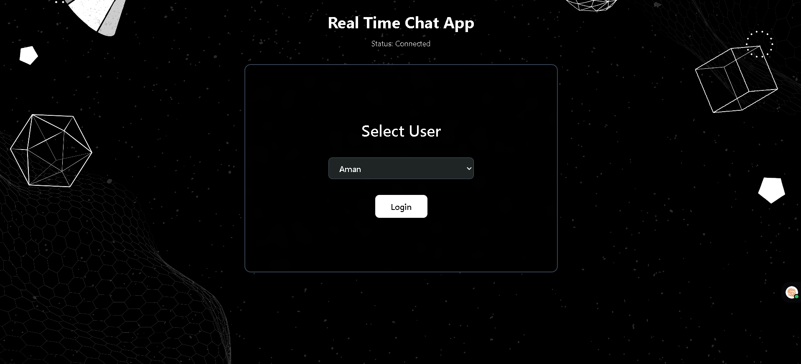
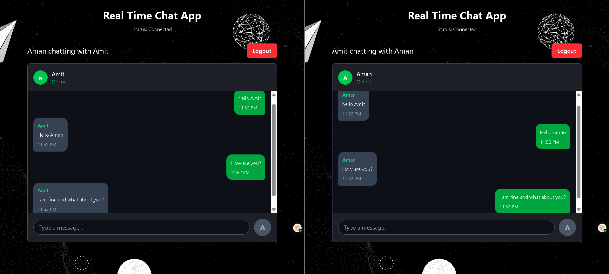

# ⚡ Real-Time Chat App – Powered by ZEGOCLOUD

A minimal yet powerful peer-to-peer chat application built with **React + TailwindCSS**, using **ZEGOCLOUD ZIM SDK**.  
This app simulates **1-on-1 messaging** between two users (**Aman & Amit**) with real-time updates, message history, and secure token-based login.

---

## 🔧 Tech Stack
- ⚛️ **React (Vite)**
- 🌐 **ZEGOCLOUD ZIM SDK**
- 🎨 **TailwindCSS**
- 📜 **JavaScript (ES6)**
- 🔐 **dotenv (.env)** for managing secrets (App ID, tokens)

---

## ✨ Features
- ✅ Real-time peer-to-peer messaging  
- ✅ Token-based login using ZEGOCLOUD  
- ✅ In-memory message history  
- ✅ Online status indicator  
- ✅ Two-user chat simulation (Aman & Amit)  
- ✅ Smooth and responsive UI with TailwindCSS  
- ✅ Auto-scroll to latest message  
- ✅ Logout / re-login functionality  

---

## 📸 Screenshots
**Login Screen**  


**Chat Interface**  


---

## 🚀 Live Demo
🌐 Try it live here 👉 [Chat App Demo](https://amanvermachatapp.netlify.app/)

---

## 🛠️ Setup Instructions

### 1. Clone the repository
```bash
git clone https://github.com/amanverma420/Chatapp.git
cd chatappzego
````

### 2. Install dependencies

```bash
npm install
```

### 3. Configure environment variables

Create a `.env` file in the root directory and add:

```bash
VITE_ZIM_APP_ID=your_zego_app_id
VITE_TOKEN_AMAN=your_token_for_aman
VITE_TOKEN_AMIT=your_token_for_amit
```

### 4. Run the development server

```bash
npm run dev
```

Now open your browser and visit: [http://localhost:5173](http://localhost:5173)

---

## 📚 Useful Resources

* 📘 [ZEGOCLOUD SDK Docs](https://www.zegocloud.com/docs)
* 📘 [React Docs](https://react.dev/)
* 📘 [TailwindCSS Docs](https://v2.tailwindcss.com/docs)

---

## 📝 License

This project is licensed under the **MIT License**.
Feel free to use, modify, and distribute — just give proper credit. 😊

---

## ✨ Author

👤 **Aman Verma**
📧 Email: [amanv2225@gmail.com](mailto:amanv2225@gmail.com)
🔗 LinkedIn: [Aman Verma LinkedIn](https://www.linkedin.com/in/amanverma420/)

```
```
